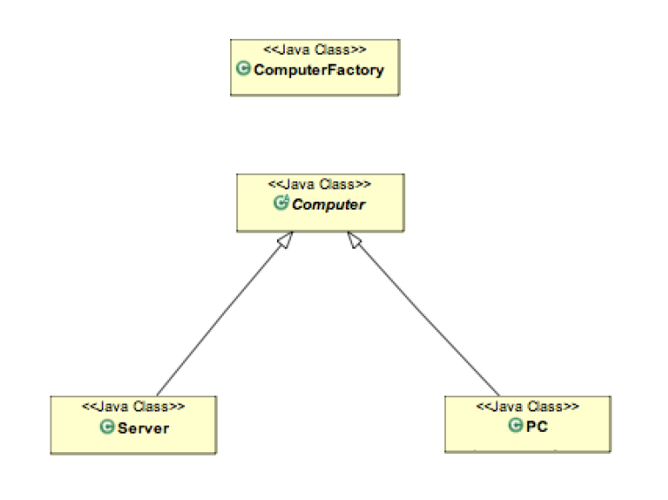
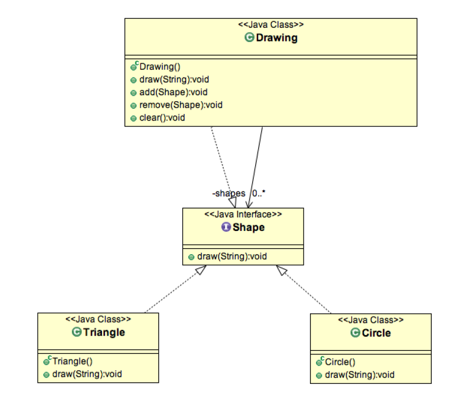
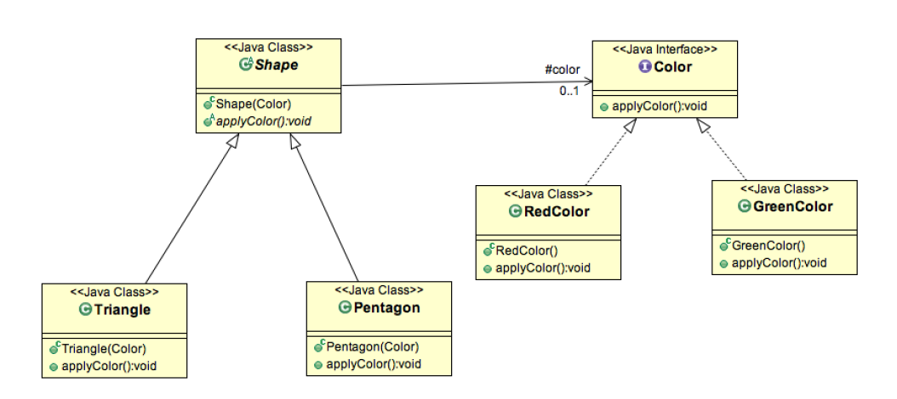
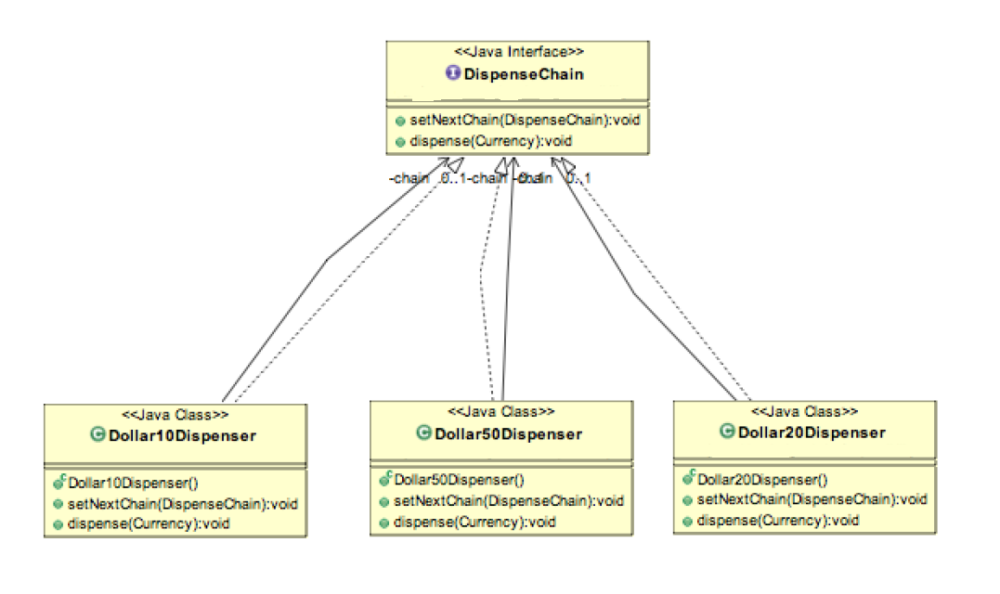
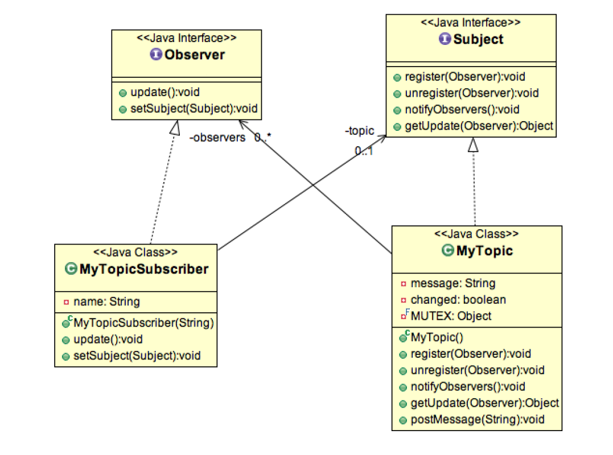
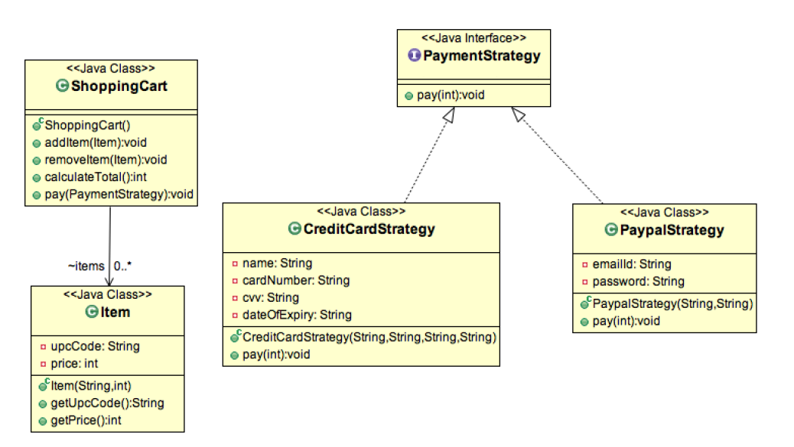
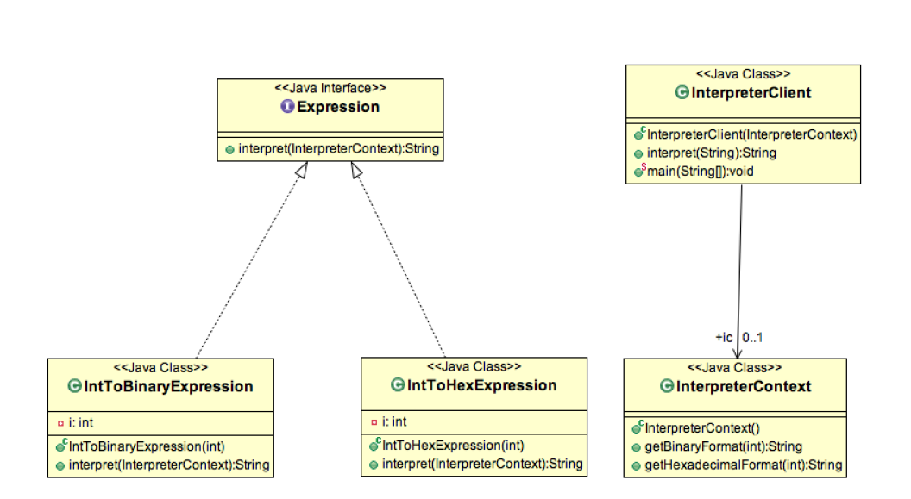

# GoF Patterns
## Design Patterns Overview
**Design Patterns** are very popular among software developers. A design pattern is a well-described solution to a 
common software problem.

Some of the benefits of using design patterns are:
- _Design Patterns are already defined and provides industry standard approach to solve a recurring problem, so it 
saves time if we sensibly use the design pattern._
- _Using design patterns promotes **reusability** that leads to more robust and highly maintainable code. It helps 
in **reducing total cost of ownership** (TCO) of the software product._
- _Since design patterns are already defined, it **makes our code easy to understand** and debug. It leads to **faster 
development** and new members of team understand it easily._

_Java Design Patterns_ are divided into three categories:
1) **Creational**
2) **Structural**
3) **Behavioral**

### Creational Design Patterns
**Creational design patterns** provide solution to instantiate an object in the best possible way for specific 
situations.

The basic form of object creation could result in design problems or add unwanted complexity to the design. **Creational 
design patterns** solve this problem by controlling the object creation by different ways.

There are five creational design patterns:
1. **Singleton Pattern**
2. **Factory Pattern**
3. **Abstract Factory Pattern**
4. **Builder Pattern**
5. **Prototype Pattern**

All these patterns solve specific problems with object creation, so you should understand and use them when needed.

#### 1. Singleton Pattern
**Singleton** is one of the Gangs of Four Design patterns and comes in the Creational Design Pattern category. From 
the definition, it seems to be a very simple design pattern but when it comes to implementation, it comes with a lot 
of implementation concerns. The implementation of **Singleton** pattern has always been a controversial topic among 
developers. Here you can find different ways to implement **Singleton** and some of the best practices for its usage.

**Singleton** pattern restricts the instantiation of a class and ensures that only one instance of the class exists 
in the java virtual machine. The singleton class must provide a global access point to get the instance of the class.
**Singleton** pattern is used for _logging_, _driver objects_, _caching_ and _thread pool_.

**Singleton** design pattern is also used in other design patterns like:
- _Abstract Factory_, 
- _Builder_, 
- _Prototype_, 
- _Facade_ etc.

**Singleton** design pattern is used in core java classes also, for example: 
- _java.lang.Runtime_, 
- _java.awt.Desktop_.

To implement **Singleton** pattern, we have different approaches but all of them have following common concepts.
- _Private constructor to restrict instantiation of the class from other classes._
- _Private static variable of the same class that is the only instance of the class._
- _Public static method that returns the instance of the class, this is the global access point for outer world to get 
the instance of the singleton class._

#### 2. Factory Pattern
**Factory** Pattern is one of the **Creational** Design pattern and it’s widely used in JDK as well as frameworks like 
Spring and Struts.

**Factory** design pattern is used when we have a super class with multiple subclasses and based on input, we need to 
return one of the sub-class. This pattern take out the responsibility of instantiation of a class from client
program to the factory class.

##### Benefits of Factory Pattern
- **Factory** pattern provides approach to code for interface rather than implementation.
- **Factory** pattern removes the instantiation of actual implementation classes from client code, making it more 
robust, less coupled and easy to extend. For example, we can easily change PC class implementation because client 
program is unaware of this.
- **Factory** pattern provides abstraction between implementation and client classes through inheritance.
#####Factory Pattern Examples in JDK
- _java.util.Calendar_, ResourceBundle and NumberFormat _getInstance()_ methods uses **Factory** pattern.
- _valueOf()_ method in wrapper classes like Boolean, Integer etc.

#### 3. Abstract Factory Pattern
**Abstract Factory** is one of the **Creational** pattern and almost similar to **Factory** Pattern except the fact 
that it’s more like factory of factories.
If you are familiar with factory design pattern in java, you will notice that we have a single **Factory** class that 
returns the different sub-classes based on the input provided and factory class uses if-else or switch statement to
achieve this.

In **Abstract Factory** pattern, we get rid of if-else block and have a factory class for each sub-class and then 
an **Abstract Factory** class that will return the sub-class based on the input factory class. At first it seems 
confusing but once you see the implementation, it’s really easy to grasp and understand the minor difference between 
**Factory** and **Abstract Factory** pattern.
##### Benefits of Abstract Factory Pattern
- **Abstract Factory** pattern provides approach to code for interface rather than implementation.
- **Abstract Factory** pattern is _“factory of factories”_ and can be easily extended to accommodate more products, for 
example we can add another sub-class Laptop and a factory LaptopFactory.
- **Abstract Factory** pattern is robust and avoid conditional logic of **Factory** pattern.
##### Abstract Factory Pattern Examples in JDK
- _javax.xml.parsers.DocumentBuilderFactory#newInstance()_
- _javax.xml.transform.TransformerFactory#newInstance()_
- _javax.xml.xpath.XPathFactory#newInstance()_

#### 4. Builder Pattern
**Builder** design pattern is a **Creational** design pattern like **Factory** Pattern and **Abstract Factory** Pattern. 
This pattern was introduced to solve some of the problems with **Factory** and **Abstract Factory** design patterns 
when the Object contains a lot of attributes.

There are three major issues with **Factory** and **Abstract Factory** design patterns when the Object contains a 
lot of attributes.
- _Too Many arguments to pass from client program to the Factory class that can be error prone because most of the time, 
the type of arguments are same and from client side it’s hard to maintain the order of the argument._
- _Some of the parameters might be optional but in Factory pattern, we are forced to send all the parameters and 
optional parameters need to send as NULL._
- _If the object is heavy and its creation is complex, then all that complexity will be part of Factory classes that 
is confusing._

We can solve the issues with large number of parameters by providing a constructor with required parameters and then 
different setter methods to set the optional parameters but the problem with this is that the Object state will
be inconsistent until unless all the attributes are set explicitly.

**Builder** pattern solves the issue with large number of optional parameters and inconsistent state by providing a way 
to build the object step-by-step and provide a method that will actually return the final Object.

##### Builder Design Pattern Example in JDK
- _java.lang.StringBuilder#append()_ (unsynchronized)
- _java.lang.StringBuffer#append()_ (synchronized)

#### 5. Prototype Pattern
**Prototype** pattern is one of the **Creational** Design pattern, so it provides a mechanism of object creation. 
**Prototype** pattern is used when the Object creation is a costly affair and requires a lot of time and resources 
and you have a similar object already existing. So this pattern provides a mechanism to copy the original object to 
a new object and then modify it according to our needs. This pattern uses java cloning to copy the object.

It would be easy to understand this pattern with an example, suppose we have an Object that loads data from database. 
Now we need to modify this data in our program multiple times, so it’s not a good idea to create the Object using 
_new_ keyword and load all the data again from database. So the better approach is to clone the existing object into 
a new object and then do the data manipulation.

**Prototype** design pattern mandates that the Object which you are copying should provide the copying feature. 
It should not be done by any other class. However whether to use shallow or deep copy of the Object properties
depends on the requirements and it’s a design decision.

### Structural Design Patterns
**Structural** patterns provide different ways to create a class structure, for example using inheritance and 
composition to create a large object from small objects.

There are seven **Structural** design patterns:
1. **Adapter Pattern**
2. **Composite Pattern**
3. **Proxy Pattern**
4. **Flyweight Pattern**
5. **Facade Pattern**
6. **Bridge Pattern**
7. **Decorator Pattern**

#### 1. Adapter Design Pattern
Adapter design pattern is one of the structural design pattern and it’s used so that two unrelated interfaces 
can work together. The object that joins these unrelated interface is called an Adapter. As a real life example, 
we can think of a mobile charger as an adapter because mobile battery needs 3 volts to charge but the normal 
socket produces either 120V (US) or 240V (India). So the mobile charger works as an adapter between mobile charging
socket and the wall socket.

**Two Way Adapter Pattern**
While implementing Adapter pattern, there are two approaches – class adapter and object adapter, however both 
these approaches produce same result.
1. Class Adapter – This form uses java inheritance and extends the source interface, in our case Socket class.
2. Object Adapter – This form uses Java Composition and adapter contains the source object.

##### Adapter Pattern Example in JDK
- java.util.Arrays#asList()
- java.io.InputStreamReader(InputStream) (returns a Reader)
- java.io.OutputStreamWriter(OutputStream) (returns a Writer)

#### 2. Composite Pattern
Composite pattern is one of the Structural design pattern and is used when we have to represent a part-whole 
hierarchy. When we need to create a structure in a way that the objects in the structure has to be treated the same
way, we can apply composite design pattern.

Composite Pattern consists of following objects.
1. Base Component – Base component is the interface for all objects in the composition, client program uses base 
component to work with the objects in the composition. It can be an interface or an abstract class with some 
methods common to all the objects.
2. Leaf – Defines the behaviour for the elements in the composition. It is the building block for the composition 
and implements base component. It doesn’t have references to other Components.
3. Composite – It consists of leaf elements and implements the operations in base component.

##### Important Points about Composite Pattern
- Composite pattern should be applied only when the group of objects should behave as the single object.
- Composite pattern can be used to create a tree like structure.

java.awt.Container#add(Component) is a great example of Composite pattern in java and used a lot in Swing.

#### 3. Proxy Pattern
Proxy Design pattern is one of the Structural design pattern and in my opinion one of the simplest pattern to 
understand. Proxy pattern intent according to GoF is:

**_Provide a surrogate or placeholder for another object to control access to it_**

The definition itself is very clear and proxy pattern is used when we want to provide controlled access of a 
functionality. Let’s say we have a class that can run some command on the system. Now if we are using it, its 
fine but if we want to give this program to a client application, it can have severe issues because client 
program can issue command to delete some system files or change some settings that you don’t want. Here a proxy 
class can be created to provide controlled access of the program.

#### 4. Flyweight Pattern
According to GoF, flyweight design pattern intent is:

**_Use sharing to support large numbers of fine-grained objects efficiently_**
 
Flyweight design pattern is a Structural design pattern like Facade pattern, Adapter Pattern and Decorator 
pattern. Flyweight design pattern is used when we need to create a lot of Objects of a class. Since every object
consumes memory space that can be crucial for low memory devices, such as mobile devices or embedded systems, 
flyweight design pattern can be applied to reduce the load on memory by sharing objects.

Before we apply flyweight design pattern, we need to consider following factors:
- The number of Objects to be created by application should be huge.
- The object creation is heavy on memory and it can be time consuming too.
- The object properties can be divided into intrinsic and extrinsic properties, extrinsic properties of an Object 
should be defined by the client program.

To apply flyweight pattern, we need to divide Object property into intrinsic and extrinsic properties. Intrinsic 
properties make the Object unique whereas extrinsic properties are set by client code and used to perform
different operations. For example, an Object Circle can have extrinsic properties such as color and width.

For applying flyweight pattern, we need to create a Flyweight factory that returns the shared objects. For our 
example, let’s say we need to create a drawing with lines and Ovals. So we will have an interface Shape and its
concrete implementations as Line and Oval. Oval class will have intrinsic property to determine whether to fill 
the Oval with given color or not whereas Line will not have any intrinsic property.

##### Flyweight Pattern Example in JDK
All the wrapper classes valueOf() method uses cached objects showing use of Flyweight design pattern. The best 
example is Java String class String Pool implementation.

Important Points
- In our example, the client code is not forced to create object using Flyweight factory but we can force that 
to make sure client code uses flyweight pattern implementation but its a complete design decision
for particular application.
- Flyweight pattern introduces complexity and if number of shared objects are huge then there is a trade of between 
memory and time, so we need to use it judiciously based on our requirements.
- Flyweight pattern implementation is not useful when the number of intrinsic properties of Object is huge, 
making implementation of Factory class complex.

#### 5. Facade Pattern
Facade Pattern is one of the Structural design patterns (such as Adapter pattern and Decorator pattern) and used 
to help client applications to easily interact with the system.
According to GoF Facade design pattern is:

**_Provide a unified interface to a set of interfaces in a subsystem. Facade Pattern defines a higher-level 
interface that makes the subsystem easier to use_**
 
Provide a unified interface to a set of interfaces in a subsystem. Facade Pattern defines a higher-level interface 
that makes the subsystem easier to use.
 
Important Points
- Facade pattern is more like a helper for client applications, it doesn’t hide subsystem interfaces from the 
client. Whether to use Facade or not is completely dependent on client code.
- Facade pattern can be applied at any point of development, usually when the number of interfaces grow and system 
gets complex.
- Subsystem interfaces are not aware of Facade and they shouldn’t have any reference of the Facade interface.
- Facade pattern should be applied for similar kind of interfaces, its purpose is to provide a single interface 
rather than multiple interfaces that does the similar kind of jobs.
- We can use Factory pattern with Facade to provide better interface to client systems.

#### 6. Bridge Pattern
When we have interface hierarchies in both interfaces as well as implementations, then builder design pattern is 
used to decouple the interfaces from implementation and hiding the implementation details from the client programs. 
Like Adapter pattern, its one of the Structural design pattern.

According to GoF bridge design pattern is:

**_Decouple an abstraction from its implementation so  that the two can vary independently_**

The implementation of bridge design pattern follows the notion to prefer Composition over inheritance.

Bridge design pattern can be used when both abstraction and implementation can have different hierarchies 
independently and we want to hide the implementation from the client application.

#### 7. Decorator Pattern
Decorator design pattern is used to modify the functionality of an object at runtime. At the same time other 
instances of the same class will not be affected by this, so individual object gets the modified behavior. Decorator
design pattern is one of the structural design pattern (such as Adapter Pattern, Bridge Pattern, Composite Pattern) 
and uses abstract classes or interface with composition to implement.

Important Points
- Decorator pattern is helpful in providing runtime modification abilities and hence more flexible. It’s easy to 
maintain and extend when the number of choices are more.
- The disadvantage of decorator pattern is that it uses a lot of similar kind of objects (decorators).
- Decorator pattern is used a lot in Java IO classes, such as FileReader, BufferedReader etc.

### Behavioral Design Patterns
Behavioral patterns provide solution for the better interaction between objects and how to provide lose coupling 
and flexibility to extend easily.

1. **Template Method Pattern**
2. **Mediator Pattern**
3. **Chain of Responsibility Pattern**
4. **Observer Pattern**
5. **Strategy Pattern**
6. **Command Pattern**
7. **State Pattern**
8. **Visitor Pattern**
9. **Interpreter Pattern**
10. **Iterator Pattern**
11. **Memento Pattern**

#### 1. Template Method Pattern
Template Method is a behavioral design pattern and it’s used to create a method stub and deferring some of the 
steps of implementation to the subclasses. Template method defines the steps to execute an algorithm and it can 
provide default implementation that might be common for all or some of the subclasses.

##### Template Method Pattern in JDK
- All non-abstract methods of java.io.InputStream, java.io.OutputStream, java.io.Reader and java.io.Writer.
- All non-abstract methods of java.util.AbstractList, java.util.AbstractSet and java.util.AbstractMap.

##### Important Points
- Template method should consists of certain steps whose order is fixed and for some of the methods, implementation 
differs from base class to subclass. Template method should be final.
- Most of the times, subclasses calls methods from super class but in template pattern, superclass template method 
calls methods from subclasses, this is known as Hollywood Principle – “don’t call us, we’ll call you”.
- Methods in base class with default implementation are referred as Hooks and they are intended to be overridden by 
subclasses, if you want some of the methods to be not overridden, you can make them final, for example in our case 
we can make buildFoundation() method final because if we don’t want subclasses to override it.

#### 2. Mediator Pattern
Mediator Pattern is one of the behavioral design pattern, so it deals with the behaviors of objects. Mediator 
design pattern is used to provide a centralized communication medium between different objects in a system.
According to GoF, mediator pattern intent is:

**_Allows loose coupling by encapsulating the way disparate sets of objects interact and communicate with
each other. Allows for the actions of each object set to vary independently of one another_**
 

##### Mediator Pattern in JDK
- java.util.Timer class scheduleXXX() methods
- Java Concurrency Executor execute() method.
- java.lang.reflect.Method invoke() method.

##### Important Points
- Mediator pattern is useful when the communication logic between objects is complex, we can have a central point 
of communication that takes care of communication logic.
- Java Message Service (JMS) uses Mediator pattern along with Observer pattern to allow applications to subscribe 
and publish data to other applications.
- We should not use mediator pattern just to achieve lose-coupling because if the number of mediators will grow, 
then it will become hard to maintain them.

#### 3. Chain of Responsibility Pattern
Chain of responsibility design pattern is one of the behavioral design pattern. Chain of responsibility pattern 
is used to achieve lose coupling in software design where a request from client is passed to a chain of objects to
process them. Then the object in the chain will decide themselves who will be processing the request and whether 
the request is required to be sent to the next object in the chain or not.

##### Chain of Responsibility Pattern Examples in JDK
- java.util.logging.Logger#log()
- javax.servlet.Filter#doFilter()

##### Important Points
- Client doesn’t know which part of the chain will be processing the request and it will send the request to the 
first object in the chain. For example, in our program ATMDispenseChain is unaware of who is processing the request 
to dispense the entered amount.
- Each object in the chain will have its own implementation to process the request, either full or partial or to 
send it to the next object in the chain. Every object in the chain should have reference to the next object in
chain to forward the request to, it’s achieved by java composition.
- Creating the chain carefully is very important otherwise there might be a case that the request will never be 
forwarded to a particular processor or there are no objects in the chain who are able to handle the request. 
In my implementation, I have added the check for the user entered amount to make sure it gets processed fully by 
all the processors but we might not check it and throw exception if the request reaches the last object and there 
are no further objects in the chain to forward the request to. This is a design decision.
- Chain of Responsibility pattern is good to achieve lose coupling but it comes with the trade-off of having a 
lot of implementation classes and maintenance problems if most of the code is common in all the implementations.

#### 4. Observer Pattern
Observer pattern is one of the behavioral design pattern. Observer design pattern is useful when you are interested 
in the state of an object and want to get notified whenever there is any change. In observer pattern, the object
that watch on the state of another object are called Observer and the object that is being watched is called Subject. 
According to GoF, observer pattern intent is:

**_Define a one-to-many dependency between objects so that when one object changes state, all its dependents are
notified and updated automatically._**
 

Observer pattern is also called as publish-subscribe pattern. Some of it’s implementations are;
- java.util.EventListener in Swing
- javax.servlet.http.HttpSessionBindingListener
- javax.servlet.http.HttpSessionAttributeListener

#### 5. Strategy Pattern
Strategy pattern is one of the behavioral design pattern. Strategy pattern is used when we have multiple algorithm 
for a specific task and client decides the actual implementation to be used at runtime.

Strategy pattern is also known as Policy Pattern. We defines multiple algorithms and let client application pass 
the algorithm to be used as a parameter. One of the best example of this pattern is Collections.sort() method that 
takes Comparator parameter. Based on the different implementations of Comparator interfaces, the Objects are getting 
sorted in different ways, check this post for sorting objects in java using Java Comparable and Comparator.

## Important Points
- We could have used composition to create instance variable for strategies but we should avoid that as we want 
the specific strategy to be applied for a particular task, same is followed in Collections.sort() and Arrays.sort() 
method that take comparator as argument.
- Strategy Pattern is very similar to State Pattern. One of the difference is that Context contains state as 
instance variable and there can be multiple tasks whose implementation can be dependent on the state whereas in 
strategy pattern strategy is passed as argument to the method and context object doesn’t have any variable to store it.
- Strategy pattern is useful when we have multiple algorithms for specific task and we want our application to be 
flexible to choose any of the algorithm at runtime for specific task.

#### 6. Command Pattern
Command Pattern is one of the Behavioral Design Pattern and it’s used to implement lose coupling in a request-response 
model. In command pattern, the request is send to the invoker and invoker pass it to the encapsulated command object. 
Command object passes the request to the appropriate method of Receiver to perform the specific action. The client
program create the receiver object and then attach it to the Command. Then it creates the invoker object and attach 
the command object to perform an action. Now when client program executes the action, it’s processed based
on the command and receiver object.

##### Command Pattern JDK Example
Runnable interface (java.lang.Runnable) and Swing Action (javax.swing.Action) uses command pattern.
##### Important Points
- Command is the core of this pattern that defines the contract for implementation.
- Receiver implementation is separate from command implementation.
- Command implementation classes chose the method to invoke on receiver object, for every method in receiver 
there will be a command implementation. It works as a bridge between receiver and action methods.
Invoker class just forward the request from client to the command object.
- Client is responsible to instantiate appropriate command and receiver implementation and then associate them together.
- Client is also responsible for instantiating invoker object and associating command object with it and execute 
the action method.
- Command pattern is easily extendable, we can add new action methods in receivers and create new Command 
implementations without changing the client code.
- The drawback with Command pattern is that the code gets huge and confusing with high number of action methods and 
because of so many associations.

#### 7. State Pattern
State pattern is one of the behavioral design pattern. State design pattern is used when an Object change its 
behavior based on its internal state.

If we have to change the behavior of an object based on its state, we can have a state variable in the Object 
and use if-else condition block to perform different actions based on the state. State pattern is used to provide a
systematic and lose-coupled way to achieve this through Context and State implementations.

Context is the class that has a State reference to one of the concrete implementations of the State and forwards the 
request to the state object for processing.

The benefits of using State pattern to implement polymorphic behavior is clearly visible, the chances of error 
are less and it’s very easy to add more states for additional behavior making it more robust, easily maintainable and
flexible. Also State pattern helped in avoiding if-else or switch-case conditional logic in this scenario.

#### 8. Visitor Pattern
Visitor Pattern is one of the behavioral design pattern. Visitor pattern is used when we have to perform an 
operation on a group of similar kind of Objects. With the help of visitor pattern, we can move the operational logic
from the objects to another class.

The benefit of this pattern is that if the logic of operation changes, then we need to make change only in the 
visitor implementation rather than doing it in all the item classes.

Another benefit is that adding a new item to the system is easy, it will require change only in visitor interface 
and implementation and existing item classes will not be affected.

The drawback of visitor pattern is that we should know the return type of visit () methods at the time of designing 
otherwise we will have to change the interface and all of its implementations. Another drawback is that if there
are too many implementations of visitor interface, it makes it hard to extend.

#### 9. Interpreter Pattern
Interpreter pattern is one of the behavioral design pattern and is used to define a grammatical representation 
for a language and provides an interpreter to deal with this grammar. The best example of this pattern is
java compiler that interprets the java source code into byte code that is understandable by JVM. Google Translator 
is also an example of interpreter pattern where the input can be in any language and we can get the output
interpreted in another language.

##### Important Points
- Interpreter pattern can be used when we can create a syntax tree for the grammar we have.
- Interpreter pattern requires a lot of error checking and a lot of expressions and code to evaluate them, 
it gets complicated when the grammar becomes more complicated and hence hard to maintain and provide efficiency.
- java.util.Pattern and subclasses of java.text.Format are some of the examples of interpreter pattern used in JDK.

#### 10. Iterator Pattern
Iterator pattern in one of the behavioral pattern and it’s used to provide a standard way to traverse through 
a group of Objects. Iterator pattern is widely used in Java Collection Framework where Iterator interface provides
methods for traversing through a collection. According to GoF, iterator design pattern intent is:

**_Provides a way to access the elements of an aggregate object without exposing its underlying representation_**

Iterator pattern is not only about traversing through a collection, we can provide different kind of iterators 
based on our requirements. Iterator pattern hides the actual implementation of traversal through the collection 
and client programs just use iterator methods.

##### Iterator Pattern in JDK
We all know that Collection framework Iterator is the best example of iterator pattern implementation but do you 
know that java.util.Scanner class also Implements Iterator interface. Read this post to learn about Java
Scanner Class(https://www.journaldev.com/872/java-scanner-class-java-util-scanner).

##### Important Points
- Iterator pattern is useful when you want to provide a standard way to iterate over a collection and hide the 
implementation logic from client program.
- The logic for iteration is embedded in the collection itself and it helps client program to iterate over them easily.

#### 11. Memento Pattern
Memento pattern is one of the behavioral design pattern. Memento design pattern is used when we want to save the 
state of an object so that we can restore later on. Memento pattern is used to implement this in such a way that 
the saved state data of the object is not accessible outside of the object, this protects the integrity of saved 
state data.

Memento pattern is implemented with two objects – Originator and Caretaker. Originator is the object whose state 
needs to be saved and restored and it uses an inner class to save the state of Object. The inner class
is called Memento and its private, so that it can’t be accessed from other objects.

Caretaker is the helper class that is responsible for storing and restoring the Originator’s state through Memento 
object. Since Memento is private to Originator, Caretaker can’t access it and it’s stored as a Object within the
caretaker.
