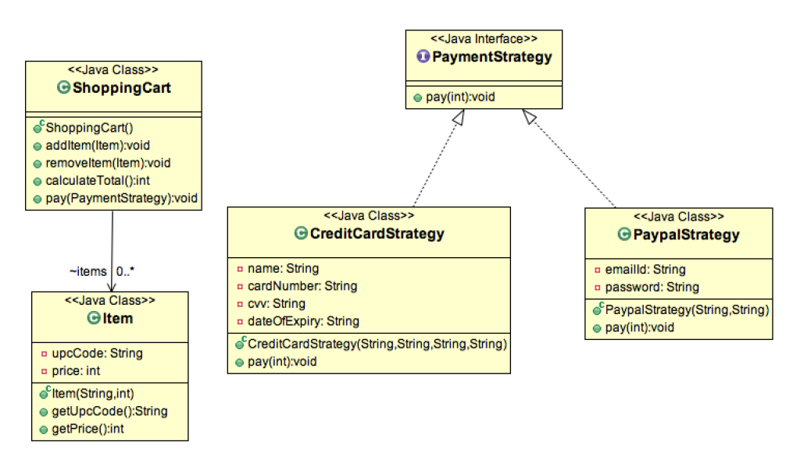

# Strategy Pattern

Strategy pattern is one of the behavioral design pattern. Strategy pattern
is used when we have multiple algorithm for a specific task and client
decides the actual implementation to be used at runtime.

Strategy pattern is also known as Policy Pattern. We defines multiple
algorithms and let client application pass the algorithm to be used as a
parameter. One of the best example of this pattern is Collections.sort()
method that takes Comparator parameter. Based on the different
implementations of Comparator interfaces, the Objects are getting sorted in
different ways, check this post for sorting objects in java using Java
Comparable and Comparator.

## Important Points
- We could have used composition to create instance variable for
strategies but we should avoid that as we want the specific strategy to
be applied for a particular task, same is followed in Collections.sort()
and Arrays.sort() method that take comparator as argument.
- Strategy Pattern is very similar to State Pattern. One of the
difference is that Context contains state as instance variable and there
can be multiple tasks whose implementation can be dependent on the
state whereas in strategy pattern strategy is passed as argument to the
method and context object doesn’t have any variable to store it.
- Strategy pattern is useful when we have multiple algorithms for
specific task and we want our application to be flexible to choose any
of the algorithm at runtime for specific task.