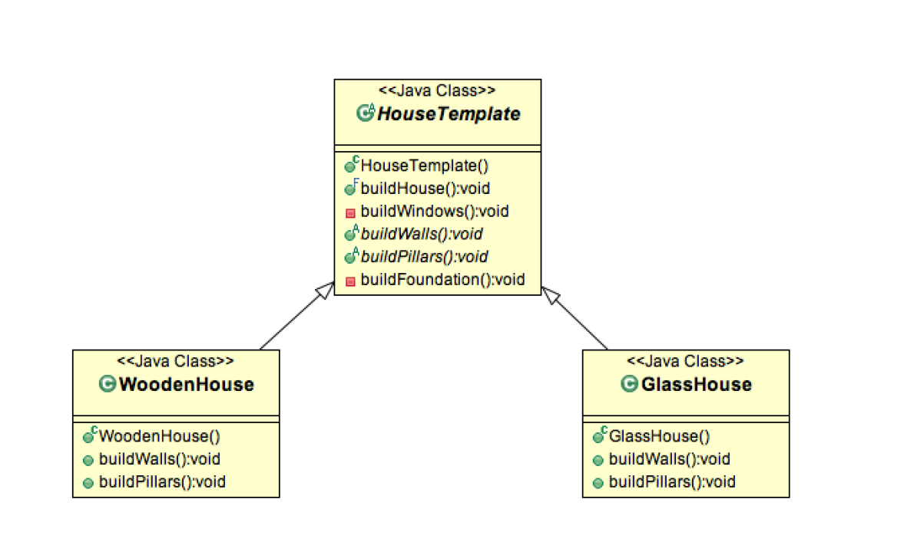

# Template Method Pattern
Template Method is a behavioral design pattern and it’s used to create a
method stub and deferring some of the steps of implementation to the
subclasses. Template method defines the steps to execute an algorithm and
it can provide default implementation that might be common for all or some
of the subclasses.

## Template Method Pattern in JDK
- All non-abstract methods of java.io.InputStream, java.io.OutputStream, java.io.Reader and java.io.Writer.
- All non-abstract methods of java.util.AbstractList, java.util.AbstractSet and java.util.AbstractMap.

## Important Points
- Template method should consists of certain steps whose order is fixed
   and for some of the methods, implementation differs from base class
   to subclass. Template method should be final.
- Most of the times, subclasses calls methods from super class but in
   template pattern, superclass template method calls methods from
   subclasses, this is known as Hollywood Principle – “don’t call us,
   we’ll call you”.
- Methods in base class with default implementation are referred as
   Hooks and they are intended to be overridden by subclasses, if you
   want some of the methods to be not overridden, you can make them
   final, for example in our case we can make buildFoundation() method
   final because if we don’t want subclasses to override it.