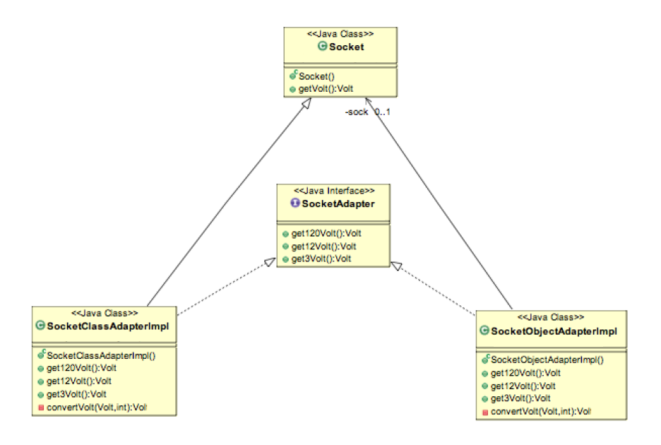

#Adapter Design Pattern
Adapter design pattern is one of the structural design pattern and it’s
used so that two unrelated interfaces can work together. The object that joins
these unrelated interface is called an Adapter. As a real life example, we
can think of a mobile charger as an adapter because mobile battery needs 3
volts to charge but the normal socket produces either 120V (US) or 240V
(India). So the mobile charger works as an adapter between mobile charging
socket and the wall socket.

Two Way Adapter Pattern
While implementing Adapter pattern, there are two approaches – class
adapter and object adapter, however both these approaches produce same
result.
1. Class Adapter – This form uses java inheritance and extends the
source interface, in our case Socket class.
2. Object Adapter – This form uses Java Composition and adapter
contains the source object.

##Adapter Pattern Example in JDK
- java.util.Arrays#asList()
- java.io.InputStreamReader(InputStream) (returns a Reader)
- java.io.OutputStreamWriter(OutputStream) (returns a Writer)
