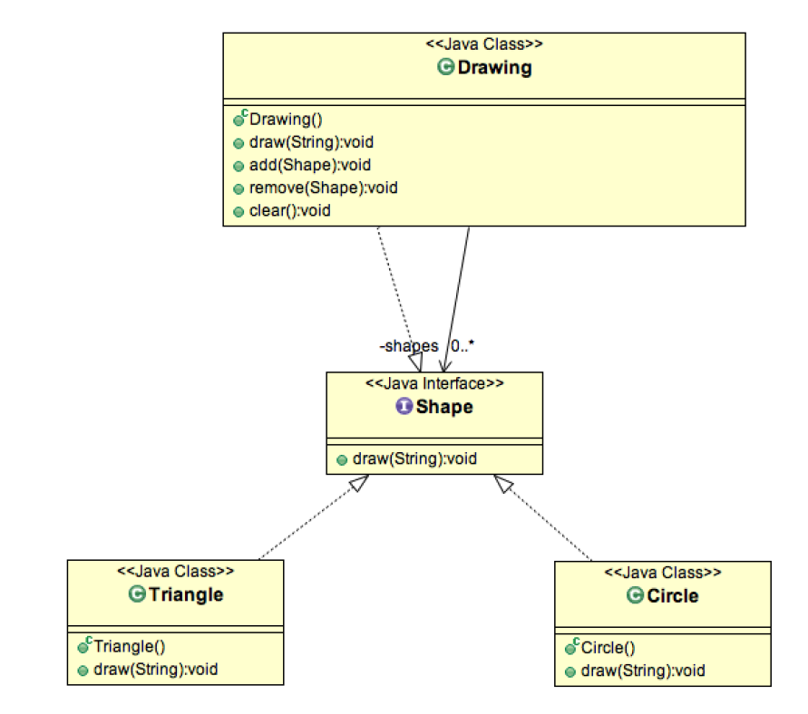

#Composite Pattern
Composite pattern is one of the Structural design pattern and is used
when we have to represent a part-whole hierarchy. When we need to create a
structure in a way that the objects in the structure has to be treated the same
way, we can apply composite design pattern.

Composite Pattern consists of following objects.
1. Base Component – Base component is the interface for all objects in
the composition, client program uses base component to work with
the objects in the composition. It can be an interface or an abstract
class with some methods common to all the objects.
2. Leaf – Defines the behaviour for the elements in the composition. It is
the building block for the composition and implements base
component. It doesn’t have references to other Components.
3. Composite – It consists of leaf elements and implements the
operations in base component.

##Important Points about Composite Pattern
- Composite pattern should be applied only when the group of objects
should behave as the single object.
- Composite pattern can be used to create a tree like structure.

java.awt.Container#add(Component) is a great example of Composite
pattern in java and used a lot in Swing.
